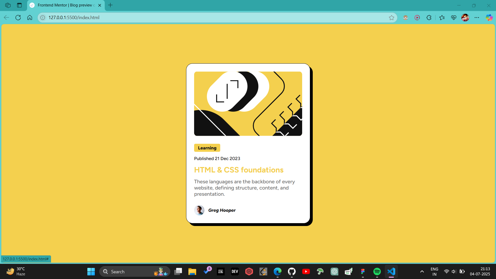
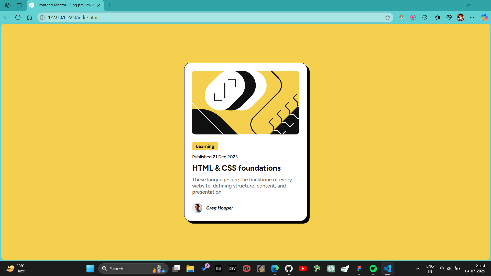
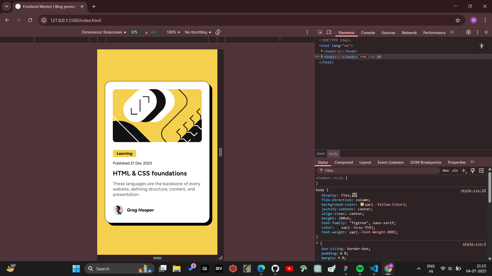

# Frontend Mentor - Blog Preview Card Solution

This is my solution to the [Blog preview card challenge on Frontend Mentor](https://www.frontendmentor.io/challenges/blog-preview-card-ckPaj01IcS). This project helped me sharpen my HTML and CSS fundamentals, including responsive design, accessibility, and semantic markup.

## Table of contents

- [Overview](#overview)
  - [The challenge](#the-challenge)
  - [Screenshot](#screenshot)
  - [Links](#links)
- [My process](#my-process)
  - [Built with](#built-with)
  - [What I learned](#what-i-learned)
  - [Continued development](#continued-development)
  - [Useful resources](#useful-resources)
- [Author](#author)

---

## Overview

### The challenge

Users should be able to:

- View the optimal layout for the component depending on their device’s screen size
- See hover and focus states for all interactive elements on the page

### Screenshot

<!-- Replace with your own screenshot -->

### Links

- 🔗 [Solution URL](https://github.com/MSAndromeda/blog-preview-card)
- 🔗 [Live Site URL](https://msandromeda.github.io/blog-preview-card/)

---

## My process

### Built with

- Semantic HTML5 markup
- CSS custom properties (variables)
- Flexbox
- Clamp for responsive typography
- Mobile-first workflow

### What I learned

This challenge helped me understand the importance of accessibility (like using `aria-label`), RTL-friendly layout techniques using logical properties, and modern responsive techniques like `clamp()` for fluid font sizes.

### Continued development

I plan to improve:

- Accessibility further using roles and better ARIA practices
- Responsive scaling using `container queries`
- Component reusability using frameworks like React

### Useful resources

- [MDN: Responsive typography with clamp()](https://developer.mozilla.org/en-US/docs/Web/CSS/clamp)
- [CSS Logical Properties Reference](https://developer.mozilla.org/en-US/docs/Web/CSS/CSS_logical_properties)
- [Frontend Mentor](https://www.frontendmentor.io/) – for consistent real-world practice

---

## Author

- Frontend Mentor – [@MSAndromeda](https://www.frontendmentor.io/profile/MSAndromeda)
